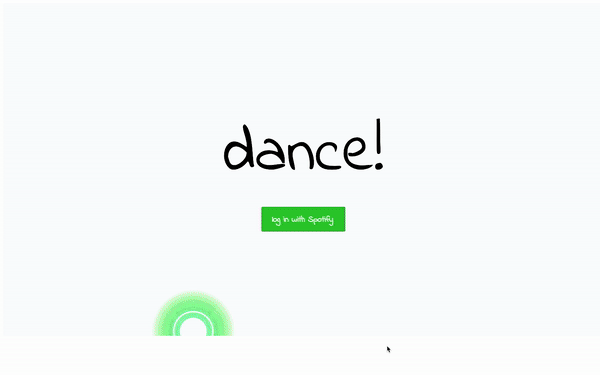

# Danceability: Unveiling Your Spotify Trends

## Overview

**Danceability** elegantly bridges the gap between your Spotify listening habits and the vibrant world of data visualization. <!-- Experience the live application [here](https://danceability1.herokuapp.com/) and embark on a journey through your musical preferences, visualized. -->

Leveraging the rich data from Spotify's API, Danceability presents an interactive exploration of your top 50 tracks, focusing on their danceability and energy levels. This project was born out of a passion for music, a curiosity for data visualization, and the challenge of harnessing the power of Spotify's API and the d3.js library.



## Core Features

- **Personalized Spotify Insights**: Seamlessly log into your Spotify account to fetch your unique listening history.
- **Interactive Data Visualization**: Employ the d3.js library to craft a dynamic graph that not only plots your music tracks based on danceability and energy but also reveals detailed track information through tooltips on hover.
- **Aesthetic Design**: A harmonious blend of CSS and HTML brings the data to life, ensuring a captivating user experience.

### Spotify Authentication

Danceability offers a personalized experience by enabling users to log in with their Spotify credentials. This secure authentication facilitates direct access to their Spotify listening history, ensuring a tailored data visualization experience.

### Data Visualization
The heart of Danceability lies in its use of the d3.js library to visualize your Spotify data. Each track is represented as a circle, with its size and placement reflecting its rank and attributes like danceability and energy. This interactive graph not only showcases your music trends but also invites you to discover the stories behind each song.

``` javascript
svg.append('g')
      .selectAll("dot")
      .data(tracks)
      .enter()
      .append("circle")
      .attr("cx", function (d) { return x(d.energy); })
      .attr("cy", function (d) { return y(d.danceability); })
      .attr('r', function (d) {
        return Math.sqrt((50 - d.idx) * 15)})
      .style("opacity", 0.6)
      .style("fill", function () {
        return "hsl(" + Math.random() * 320 + ",80%,60%)";})
      .attr('stroke', function (d) {
        return strokes[d.idx % 7]})
      .on("mouseover", function (d) {
        d3.select(this)
      .style("opacity", 1)
        div.transition()
      .duration(200)
      .style("opacity", .9);
        div.html("Rank: " + (d.idx + 1) + "<br/>" + `"${d.title}"` + "<br/>" + d.artist + "<br/>" + "Danceability: " +
        `${d.danceability}` + "<br/>" + "Energy: " + `${d.energy}`)
      .style("left", (d3.event.pageX + 20) + "px")
      .style("top", (d3.event.pageY - 28) + "px");})
      .on("mouseout", function (d) {
        d3.select(this)
      .style("opacity", .6)
        div.transition()
      .duration(500)
      .style("opacity", 0);
      })

```

## `Development Timeline`

1. Spotify API & d3.js Exploration: Dedicating time to understand the intricacies of Spotify's API and the d3.js library laid the groundwork for this project. 

2. Initial Setup & API Integration: Establishing a robust Node/Express server foundation to facilitate seamless API communication. 

3. Visualization & Styling: Implementing and refining the interactive d3.js graph, followed by meticulous styling to enhance user engagement.

4. Final improvements to the UI.  


